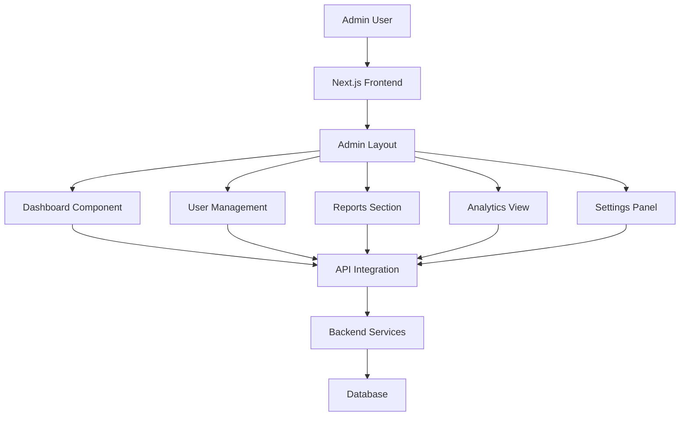

# Admin Dashboard Preview: 10-Step Implementation Plan

## Overview
This document outlines a 10-step approach to implement and preview admin features for the CloudFi Labs platform. The admin dashboard provides comprehensive management capabilities for users, reports, analytics, and system settings.

Based on the existing implementation, the admin dashboard already includes:
- Dashboard with key metrics visualization
- User management interface
- Navigation system with sidebar
- Responsive design for mobile and desktop
- Authentication checks

The following 10 steps will enhance and expand these capabilities.

## Technology Stack
- Next.js 14 with App Router
- React 18 with TypeScript
- Tailwind CSS for styling
- Lucide React for icons
- Responsive design for all device sizes

## 10-Step Implementation Plan

### Step 1: Dashboard Overview
Enhance the existing dashboard view with additional key metrics and statistics:
- Total users count with growth indicators
- Revenue metrics with trend visualization
- Reports generated with completion status
- Active user count with real-time updates
- Visual indicators for growth trends
- Quick action buttons for common tasks

### Step 2: User Management Interface
Enhance the existing user management section with:
- User listing table with advanced sorting and filtering capabilities
- User details view with comprehensive profile information
- Role assignment functionality with permission matrix
- User status management (active/inactive/pending)
- Quick edit actions for each user
- Bulk user operations (activate/deactivate/delete)
- User invitation system

### Step 3: Analytics Visualization
Develop advanced analytics components including:
- Revenue overview charts with comparison periods
- User engagement metrics with behavioral analysis
- Time-series data visualization with forecasting
- Custom dashboard widgets
- Export functionality for reports (PDF, CSV, Excel)
- Real-time data streaming capabilities

### Step 4: Reporting System
Create an advanced reports section with:
- Report generation interface with drag-and-drop builder
- Report templates management with version control
- Scheduled reports functionality with recurring options
- Report sharing and collaboration features
- Export options (PDF, CSV, Excel, Google Sheets)
- Report scheduling and delivery system

### Step 5: System Settings
Implement comprehensive system configuration options:
- General platform settings with branding customization
- Notification preferences with channel management
- Security configuration with audit logging
- API key management with access controls
- Integration settings for third-party services
- Performance tuning options

### Step 6: Navigation Enhancement
Improve admin navigation with:
- Collapsible sidebar for desktop with pinned favorites
- Mobile-friendly navigation menu with gesture support
- Breadcrumb navigation with context awareness
- Quick access toolbar with customizable shortcuts
- Search functionality across all admin sections
- Keyboard navigation shortcuts

### Step 7: Activity Monitoring
Add comprehensive activity tracking features:
- Recent activity timeline with filtering options
- User action logs with detailed metadata
- System event monitoring with alerting
- Audit trail functionality with export capabilities
- Real-time activity streaming
- Anomaly detection and alerts

### Step 8: Data Management
Implement advanced data handling capabilities:
- Bulk user operations with validation
- Data import/export tools with format conversion
- Database backup interface with scheduling
- Data cleansing utilities with duplicate detection
- Data migration tools
- Data privacy compliance features (GDPR, CCPA)

### Step 9: Performance Optimization
Enhance dashboard performance with advanced techniques:
- Lazy loading for large datasets with virtualization
- Pagination and infinite scrolling for tables
- Intelligent caching strategies with invalidation
- Loading state indicators with skeleton screens
- Performance monitoring and profiling
- Code splitting and bundle optimization

### Step 10: Security & Access Control
Implement comprehensive security measures:
- Role-based access control with fine-grained permissions
- Session management with timeout and renewal
- Two-factor authentication with multiple providers
- Activity logging with security event detection
- IP whitelisting and geofencing
- Password policies and security questions

## Component Architecture

### Main Components
1. **Dashboard** - Main overview page with metrics
2. **User Management** - User listing and management
3. **Reports** - Report generation and management
4. **Analytics** - Data visualization components
5. **Settings** - System configuration interface

### UI Components
1. **Stat Cards** - Metric display cards with icons
2. **Data Tables** - Sortable and filterable tables
3. **Charts** - Data visualization components
4. **Navigation** - Sidebar and top navigation
5. **Forms** - Input forms for data management

## Data Flow

## State Management
- Local component state for UI interactions
- React hooks for data fetching and management
- Context API for global state when needed
- Server-side data fetching with Next.js

## Responsive Design
- Mobile-first approach
- Responsive grid layouts
- Adaptive navigation for different screen sizes
- Touch-friendly interface elements

## Testing Strategy
- Unit tests for individual components
- Integration tests for data flows
- End-to-end tests for critical user paths
- Accessibility testing for compliance

## Performance Considerations
- Code splitting for faster initial loads
- Image optimization for assets
- Efficient data fetching strategies
- Caching for improved response times

## Security Measures
- Authentication verification on all admin routes
- Authorization checks for user roles
- Input validation and sanitization
- Secure API communication